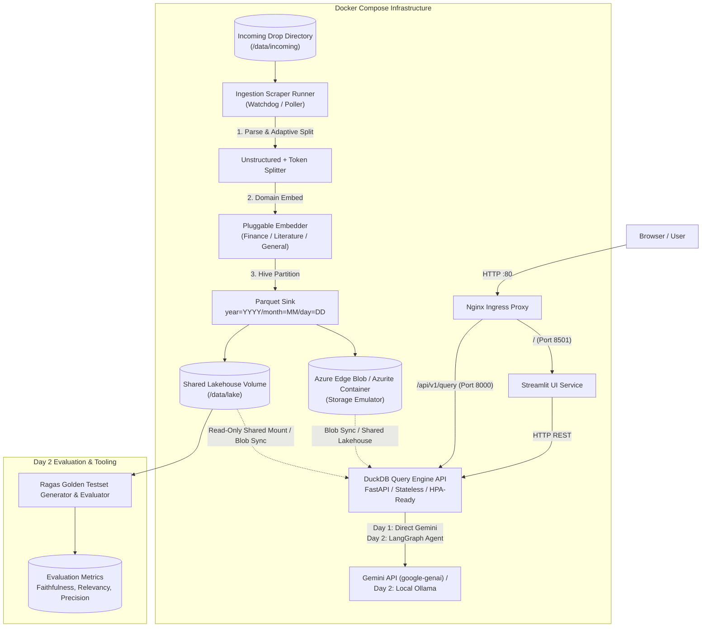
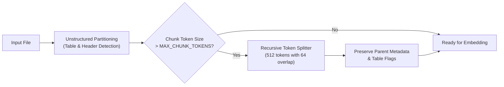

# Product Requirements Document (PRD)
## Project: Multi-Domain Containerized RAG Platform with DuckDB Lakehouse & Edge Blob

**Document Version:** 1.0.0  
**Target Delivery:** Day 1 (Core Ingestion & Lakehouse Engine) & Day 2 (Agentic Orchestration & Ragas Evaluation)  
**Target Environment:** Local Docker Compose / Kubernetes (HPA-Ready) / VS Code + Antigravity

---

## 1. Executive Summary & Objectives

### 1.1 Mission
Build a production-ready, locally orchestratable Retrieval-Augmented Generation (RAG) platform tailored for deep document research (starting with SEC EDGAR financial filings: 10-K, 10-Q, 8-K, and extensible to arbitrary documents).

### 1.2 Core Architectural Differentiators
* **Zero-VectorDB Data Lakehouse**: Embeddings are stored directly in **Hive-partitioned Parquet files** (`year=YYYY/month=MM/day=DD`) synced to an **Azure Edge Blob Storage** container, eliminating external vector database lock-in and infrastructure cost.
* **Microservices via Docker Compose**: Fully containerized topology comprising an **Nginx Ingress reverse proxy**, **Azure Edge Blob (Azurite/Edge Blob emulator)**, an **HPA-ready stateless DuckDB Query Engine microservice**, an **automated directory-scraping Ingestion Runner**, and a **Streamlit UI**.
* **Adaptive Chunking**: Two-stage chunking using `unstructured` for semantic element and table preservation, coupled with a secondary recursive splitter to guarantee bounded chunk token sizes for oversized elements.
* **Pluggable Domain Embedders**: Dynamic model configuration allowing runtime switching between domain-specialized embeddings (e.g., Finance vs Literature/Fiction vs General).
* **Day 2 Agentic & Eval Framework**: **LangGraph** for multi-hop analytical query routing, **FlashRank/Cross-Encoder** re-ranking, and **Ragas** for synthetic golden testset generation and automated evaluation.

---

## 2. System Architecture & Topology



---

## 3. Container Services Specification (Docker Compose)

The environment must boot via a single `docker-compose.yml` defining the following services:

### 3.1 `nginx` (Ingress Reverse Proxy)
* **Image**: `nginx:alpine`
* **Ports**: Exposes `80:80` to host.
* **Routing Rules**:
  * `/` and `/_stcore/*` $\to$ `http://streamlit:8501` (WebSocket support enabled).
  * `/api/*` $\to$ `http://query-engine:8000/api/*`.
  * `/health` $\to$ Aggregated health check.

### 3.2 `edgeblob` (Azure Edge Blob / Storage Emulator)
* **Image**: `mcr.microsoft.com/azure-storage/azurite:latest` (or `mcr.microsoft.com/azure-blob-storage:latest`)
* **Ports**: `10000:10000` (Internal Docker network + optionally host for debugging).
* **Storage Volume**: Named volume `edgeblob_data:/data` mounted to persist blob containers (e.g., `sec-filings-lake`).
* **Storage Volume**: Host-mounted directory `./data/lake:/data` mounted to persist blob containers (e.g., `corpus-lake`).

### 3.3 `ingestion-runner` (Directory Scraper & Ingestion Pipeline)
* **Role**: Daemon process monitoring `/data/incoming`.
* **Behavior**:
  * Watches for newly added PDF, HTML, or JSON files (via `watchdog` or polling interval).
  * Moves processed files to `/data/processed/` or `/data/failed/` upon completion.
  * Emits status logs and ingestion summaries.
* **Resource Config**: Configurable CPU/Memory limits, local model cache volume `model_cache:/root/.cache/huggingface`.

### 3.4 `query-engine` (Stateless DuckDB Query Service - HPA-Ready)
* **Framework**: FastAPI (Python 3.11+), served with Uvicorn.
* **HPA / Scaling Design**:
  * **Stateless execution**: Queries execute against read-only mounts of the Parquet directory lakehouse (`/data/lake`) or remote Edge Blob parquet blobs using DuckDB's native HTTPFS / Azure extensions.
  * DuckDB connection is opened in **read-only mode** per worker, allowing arbitrary replica scaling ($N$ query pods behind Nginx round-robin) without file locking contentions.
* **Endpoints**:
  * `POST /api/v1/query`: Accepts question, domain profile, ticker/date filters, top-K. Returns ranked context chunks, similarity scores, metadata, and generated answer.
  * `POST /api/v1/search`: Raw vector similarity + SQL filtering returning candidate chunks without LLM synthesis.
  * `GET /healthz`: Kubernetes liveness/readiness probe.

### 3.5 `streamlit` (Research Dashboard UI)
* **Port**: `8501`
* **Features**:
  * Interactive Research Assistant (Chat interface with citations).
  * Document Ingestion Monitor (Drop files, view ingestion queue, trigger SEC fetches).
  * Parquet Lake Explorer (Inspect partitions, view schema, run live DuckDB SQL queries).
  * Domain Profile & Model Switcher (Finance vs Literature vs General).

---

## 4. Pipeline Functional Specifications

### 4.1 Ingestion & Adaptive Chunking



1. **Primary Stage (`unstructured`)**:
   * Uses `unstructured.partition.auto` or `partition_html`/`partition_pdf`.
   * Preserves structural metadata: document title, section heading (`Item 1A`, `Item 7`), and HTML table representations.
2. **Secondary Stage (Recursive Token Splitting for Oversized Chunks)**:
   * Condition: If an extracted chunk (e.g. an exhaustive legal footnote or dense balance sheet) exceeds `MAX_CHUNK_TOKENS` (default: 512 tokens or 2,000 characters):
     * Split recursively using standard delimiters (`\n\n`, `\n`, `. `, ` `).
     * Preserve parent metadata (`parent_chunk_id`, `table_id`, `section`, `form_type`).
     * Apply sliding window overlap (default: 64 tokens) to prevent context fragmentation at boundaries.

### 4.2 Pluggable Transformer Embedder Configuration

The system must support domain-specific embedding profiles defined via `config.yaml` or environment variables:

| Profile Key | Recommended Model | Use Case | Vector Dimension |
| :--- | :--- | :--- | :--- |
| **`finance`** | `BAAI/bge-small-en-v1.5` or `ProsusAI/finbert` / `mrm8488/distilroberta-finetuned-financial-news-sentiment-analysis` | SEC 10-K/10-Q, quarterly earnings, balance sheets | 384 / 768 |
| **`literature`** | `sentence-transformers/all-mpnet-base-v2` or `all-MiniLM-L6-v2` | Novels, literary analysis, narrative prose | 768 / 384 |
| **`general`** | `BAAI/bge-large-en-v1.5` | General purpose documentation, research whitepapers | 1024 |

* **Dynamic Registry**:
  ```python
  class EmbeddingRegistry:
      PROFILES = {
          "finance": "BAAI/bge-small-en-v1.5",
          "literature": "sentence-transformers/all-mpnet-base-v2",
          "general": "BAAI/bge-small-en-v1.5",
      }
  ```
* Model weights must be cached locally in a persistent Docker volume (`model_cache`) to avoid downloading models on every container boot.

### 4.3 Storage & Hive Parquet Lakehouse Schema

Parquet files are written using pyarrow / fastparquet partitioned by date:
`/data/lake/domain={domain}/year={YYYY}/month={MM}/day={DD}/{chunk_batch_uuid}.parquet`

**Schema Definition**:
* `chunk_id`: `STRING` (UUIDv4)
* `doc_id`: `STRING` (File hash or SEC accession number)
* `domain`: `STRING` (`finance`, `literature`, `general`)
* `source_filename`: `STRING`
* `form_type`: `STRING` (`10-K`, `10-Q`, `8-K`, `BOOK`, `MISC`)
* `filing_date`: `DATE32`
* `section`: `STRING` (e.g., `Risk Factors`, `MD&A`, `Chapter 1`)
* `is_table`: `BOOLEAN`
* `text`: `STRING` (Chunk text content)
* `embedding`: `LIST<FLOAT>` (Fixed-size dense embedding array)
* `metadata_json`: `STRING` (Serialized JSON with page numbers, bounding boxes, parent chunk ID)

### 4.4 DuckDB Vector Retrieval Engine

DuckDB queries the globbed Parquet path directly:
```sql
SELECT 
    chunk_id, 
    source_filename,
    section, 
    text, 
    is_table,
    array_cosine_similarity(embedding, $query_vector::FLOAT[384]) AS similarity_score
FROM read_parquet('/data/lake/domain=finance/**/*.parquet')
WHERE filing_date >= $start_date
ORDER BY similarity_score DESC
LIMIT $top_k;
```
* **Performance Optimization**:
  * Push-down predicate filtering on Hive partition columns (`year`, `month`, `day`, `domain`) ensures DuckDB only reads relevant parquet files.
  * DuckDB `vss` extension or native `array_cosine_similarity` used for vectorized scoring.

---

## 5. Day 2 Specifications

### 5.1 Re-Ranking Engine
* Pipeline: DuckDB retrieves Top 50 candidates $\to$ Re-ranker filters down to Top 5 most relevant chunks.
* Implement using `FlashRank` (lightweight, zero-GPU overhead) or `cross-encoder/ms-marco-MiniLM-L-6-v2`.

### 5.2 LangGraph Multi-Hop Orchestrator
* **Graph Topology**:
  1. `QueryAnalyzer`: Decomposes complex research questions into sub-queries (e.g. *"Compare NVIDIA 2023 vs 2024 Gross Margins"* $\to$ Sub-query A for 2023 10-K, Sub-query B for 2024 10-K).
  2. `RetrieverNode`: Executes DuckDB vector retrieval for each sub-query.
  3. `RelevanceGrader`: Evaluates if retrieved chunks contain sufficient evidence. If insufficient, re-writes query and re-retrieves.
  4. `Synthesizer`: Synthesizes unified answer with cross-filing comparative citations.

### 5.3 Ragas Golden Testset Generation & Quality Gate
* **Synthetic Testset Generation**:
  * Uses `ragas.testset.synthesizers.TestsetGenerator` backed by Gemini models.
  * Samples documents from the Parquet lake and generates a test suite of 30–50 evaluation pairs (question, ground_truth, evolution_type: reasoning/multi_context/simple).
* **Automated Metrics**:
  * **Faithfulness**: Verifies zero hallucination against context.
  * **Answer Relevancy**: Verifies answer completeness without digressions.
  * **Context Precision & Context Recall**: Quantifies DuckDB retrieval accuracy against ground truth.
* **CLI Command**: `sec-rag eval --dataset golden_testset.json` outputting pass/fail thresholds in CI/CD.

### 5.4 Dual LLM Provider Support
* **Cloud**: Google Gemini 2.5/Flash via official `google-genai` SDK.
* **Local Fallback**: Ollama endpoint (e.g., `qwen2.5:7b` or `llama3.2`) configurable via `LLM_PROVIDER=ollama`.

---

## 6. Project Layout & Directory Structure

```
sec-rag-researcher/
├── docker-compose.yml              # Multi-container orchestration
├── docker/
│   ├── nginx/
│   │   └── default.conf            # Ingress proxy configuration
│   ├── ingestion/
│   │   └── Dockerfile              # Ingestion scraper container
│   ├── query_engine/
│   │   └── Dockerfile              # FastAPI + DuckDB container
│   └── streamlit/
│       └── Dockerfile              # Streamlit dashboard container
├── config/
│   ├── config.yaml                 # Embedding models, chunk limits, paths
│   └── models.json                 # Domain embedding registry
├── src/
│   ├── common/
│   │   ├── config.py               # Pydantic Settings
│   │   └── models.py               # Data schemas (Chunk, QueryRequest, QueryResponse)
│   ├── ingestion/
│   │   ├── watcher.py              # Incoming directory watcher/poller
│   │   ├── sec_fetcher.py          # SEC EDGAR downloader
│   │   ├── parser.py               # Unstructured table & header parser
│   │   ├── splitter.py             # Recursive token secondary splitter
│   │   ├── embedder.py             # Pluggable transformer embedder
│   │   └── parquet_sink.py         # Hive partitioned writer & EdgeBlob sync
│   ├── query_engine/
│   │   ├── main.py                 # FastAPI application
│   │   ├── duckdb_client.py        # DuckDB vector search & SQL execution
│   │   ├── reranker.py             # (Day 2) FlashRank / Cross-Encoder
│   │   └── llm_service.py          # Gemini & Ollama unified client
│   ├── agent/                      # (Day 2) LangGraph state graph & nodes
│   │   ├── graph.py
│   │   └── state.py
│   └── evaluation/                 # (Day 2) Ragas synthetic generator & eval
│       ├── generate_golden.py
│       └── evaluate_pipeline.py
├── ui/
│   ├── app.py                      # Main Streamlit app
│   └── components/
│       ├── chat.py
│       └── lake_explorer.py
├── data/
│   ├── incoming/                   # Scraper drop folder
│   ├── processed/                  # Archive folder
│   └── lake/                       # Hive-partitioned parquet lake
└── tests/                          # Pytest suite
```

---

## 7. Next Steps & Execution Checklist

1. **Repository & Scaffold Creation**: Set up directory structure in `C:\Users\clive\.gemini\antigravity\scratch\sec-rag-researcher`.
2. **Configuration & Model Registry**: Build `config.yaml` with finance vs literature profiles and oversized chunk limits.
3. **Ingestion & Adaptive Chunking Engine**: Build `parser.py` (Unstructured) and `splitter.py` (recursive token fallback).
4. **Parquet & DuckDB Vector Engine**: Build Hive writer and DuckDB vector search endpoint.
5. **Docker Compose & Ingress Setup**: Configure Nginx, Azurite/EdgeBlob, FastAPI query engine, Ingestion daemon, and Streamlit UI.
6. **Day 2 Enhancements**: Implement LangGraph multi-hop workflow, FlashRank re-ranking, and Ragas golden test generator.
