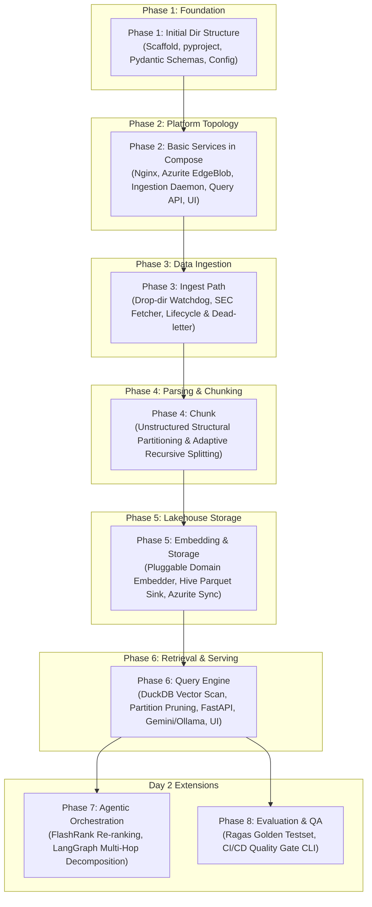

# Multi-Domain Containerized RAG Platform — Feature List

> **Source PRD:** [ducklake-rag-prd.md](file:///home/cc/ws/corpus-analyst/ducklake-rag-prd.md) (Version 1.0.0)  
> **Target Environment:** Local Docker Compose / Kubernetes (HPA-Ready) / Linux  
> **Core Architecture:** Zero-VectorDB DuckDB Lakehouse, Azure Edge Blob / Azurite, Unstructured Adaptive Chunking, LangGraph, Ragas  

---

## 1. Phased Implementation Roadmap

The platform implementation is broken down into 6 core progressive phases followed by 2 Day-2 advanced phases:



---

### Phase 1: Initial Directory Structure & Core Scaffolding
* **Focus**: Establish codebase layout, packaging, dependency management, shared data models, and typed configuration schemas.
* **Features**:
  * **`FND-01`**: Modular directory layout (`src/`, `docker/`, `config/`, `data/`, `ui/`, `tests/`), `.env.example`, `.dockerignore`, and package management (`pyproject.toml`).
  * **`FND-02`**: Shared Pydantic data schemas (`Chunk`, `DocumentMetadata`, `QueryRequest`, `QueryResponse`) and unified settings loader (`config.py`, `config.yaml`).
* **Deliverables & Paths**:
  * [`pyproject.toml`](file:///home/cc/ws/corpus-analyst/pyproject.toml)
  * [`src/common/config.py`](file:///home/cc/ws/corpus-analyst/src/common/config.py)
  * [`src/common/models.py`](file:///home/cc/ws/corpus-analyst/src/common/models.py)
  * [`config/config.yaml`](file:///home/cc/ws/corpus-analyst/config/config.yaml), [`config/models.json`](file:///home/cc/ws/corpus-analyst/config/models.json)
* **Data Contracts**: Standardized Pydantic schemas shared across ingestion, storage, and query services.
* **Verification**: `pytest tests/test_config.py tests/test_models.py` passes with zero runtime errors.

---

### Phase 2: Basic Services in Compose
* **Focus**: Stand up the multi-container Docker Compose infrastructure, ingress routing, persistent volumes, and service health checks.
* **Features**:
  * **`INF-01`**: Multi-container Compose topology (`nginx`, `edgeblob`, `ingestion-runner`, `query-engine`, `streamlit`).
  * **`INF-02`**: Nginx Ingress reverse proxy with WebSocket support and unified `/health` route.
  * **`EMB-02`**: Persistent Docker model cache volume (`model_cache:/root/.cache/huggingface`).
  * **`LAK-02` (Base)**: Azurite emulator container provisioning and blob container initialization (`sec-filings-lake`).
* **Deliverables & Paths**:
  * [`docker-compose.yml`](file:///home/cc/ws/corpus-analyst/docker-compose.yml)
  * [`docker/nginx/default.conf`](file:///home/cc/ws/corpus-analyst/docker/nginx/default.conf)
  * [`docker/ingestion/Dockerfile`](file:///home/cc/ws/corpus-analyst/docker/ingestion/Dockerfile)
  * [`docker/query_engine/Dockerfile`](file:///home/cc/ws/corpus-analyst/docker/query_engine/Dockerfile)
  * [`docker/streamlit/Dockerfile`](file:///home/cc/ws/corpus-analyst/docker/streamlit/Dockerfile)
* **Data Contracts**: Inter-container network aliases (`http://query-engine:8000`, `http://edgeblob:10000`, `http://streamlit:8501`).
* **Verification**: `docker compose up -d` brings all 5 containers to healthy state; `curl http://localhost/health` returns 200 OK.

---

### Phase 3: Ingest Path
* **Focus**: Automated file acquisition, drop-directory monitoring, and lifecycle transition handling.
* **Features**:
  * **`ING-01`**: Continuous directory watcher monitoring `/data/incoming` with complete write detection.
  * **`ING-02`**: SEC EDGAR downloader utility for 10-K, 10-Q, and 8-K filings with rate-limiting and SEC-compliant headers.
  * **`ING-05`**: Processing lifecycle management (atomic moves to `/data/processed/` or `/data/failed/` with dead-letter trace logging).
  * **`UI-02`**: Streamlit file upload interface, ingestion queue monitor, and manual SEC trigger.
* **Deliverables & Paths**:
  * [`src/ingestion/watcher.py`](file:///home/cc/ws/corpus-analyst/src/ingestion/watcher.py)
  * [`src/ingestion/sec_fetcher.py`](file:///home/cc/ws/corpus-analyst/src/ingestion/sec_fetcher.py)
  * [`ui/app.py`](file:///home/cc/ws/corpus-analyst/ui/app.py) (Ingestion tab)
* **Data Contracts**: Raw document intake (`.pdf`, `.htm`, `.html`, `.json`) placed in `/data/incoming/` $\to$ lifecycle status logged $\to$ queued for chunking.
* **Verification**: Dropping a PDF into `/data/incoming` triggers processing log; SEC downloader fetches valid NVDA 10-K filing.

---

### Phase 4: Chunk (Parsing & Adaptive Splitting)
* **Focus**: Semantic document parsing, table layout preservation, and secondary recursive token splitting.
* **Features**:
  * **`ING-03`**: Structural document partitioning via `unstructured`, preserving headings, sections, and HTML table representations (`is_table = true`).
  * **`ING-04`**: Adaptive recursive token splitter bounding chunks to `MAX_CHUNK_TOKENS` (512 tokens / ~2,000 chars) with 64-token sliding window overlap and parent lineage tracking.
* **Deliverables & Paths**:
  * [`src/ingestion/parser.py`](file:///home/cc/ws/corpus-analyst/src/ingestion/parser.py)
  * [`src/ingestion/splitter.py`](file:///home/cc/ws/corpus-analyst/src/ingestion/splitter.py)
  * [`tests/test_chunker.py`](file:///home/cc/ws/corpus-analyst/tests/test_chunker.py)
* **Data Contracts**: Raw files $\to$ Parsed Elements $\to$ List of bounded `Chunk` objects containing text, section hierarchy, table flags, and parent IDs.
* **Verification**: Unit tests confirm financial tables retain HTML layout, and no chunk exceeds 512 tokens while retaining overlap context.

---

### Phase 5: Embedding & Lakehouse Storage
* **Focus**: Pluggable domain embedding generation, Hive-partitioned Parquet storage, and edge blob synchronization.
* **Features**:
  * **`EMB-01`**: Dynamic domain embedding registry (`finance`, `literature`, `general`) with batch inference and local weight caching.
  * **`LAK-01`**: Hive-partitioned Parquet sink writing to `/data/lake/domain={domain}/year={YYYY}/month={MM}/day={DD}/{chunk_batch_uuid}.parquet` with vector arrays.
  * **`LAK-02s`**: Parquet chunk synchronization to Azurite Edge Blob container (`sec-filings-lake`).
* **Deliverables & Paths**:
  * [`src/ingestion/embedder.py`](file:///home/cc/ws/corpus-analyst/src/ingestion/embedder.py)
  * [`src/ingestion/parquet_sink.py`](file:///home/cc/ws/corpus-analyst/src/ingestion/parquet_sink.py)
  * [`tests/test_embedder.py`](file:///home/cc/ws/corpus-analyst/tests/test_embedder.py), [`tests/test_parquet_sink.py`](file:///home/cc/ws/corpus-analyst/tests/test_parquet_sink.py)
* **Data Contracts**: Chunks $\to$ Dense embedding vectors (`LIST<FLOAT>`) $\to$ PyArrow Parquet files partitioned by Hive date keys.
* **Verification**: Ingested sample generates valid Parquet files readable by PyArrow; vectors have correct dimension (384/768/1024); blob sync succeeds.

---

### Phase 6: Query Engine, Retrieval & Synthesis
* **Focus**: Stateless DuckDB vector search, Hive partition pruning, REST API, LLM synthesis, and research chat UI.
* **Features**:
  * **`QRY-01`**: Native DuckDB in-process vector similarity search over Parquet files (`array_cosine_similarity` / `vss`).
  * **`QRY-02`**: Hive partition push-down pruning (`domain`, `year`, `month`, `day`) and metadata predicate filtering (`filing_date`, `is_table`).
  * **`QRY-03`**: Stateless & HPA-ready FastAPI endpoints (`POST /api/v1/query`, `POST /api/v1/search`, `GET /healthz`).
  * **`LLM-01`**: Google Gemini cloud synthesis with grounded traceable citations (`google-genai`).
  * **`LLM-02`**: Ollama local LLM fallback option.
  * **`UI-01`, `UI-03`, `UI-04`**: Streamlit interactive chat with expandable citation cards, Parquet lake explorer with SQL console, and domain switcher.
* **Deliverables & Paths**:
  * [`src/query_engine/duckdb_client.py`](file:///home/cc/ws/corpus-analyst/src/query_engine/duckdb_client.py)
  * [`src/query_engine/llm_service.py`](file:///home/cc/ws/corpus-analyst/src/query_engine/llm_service.py)
  * [`src/query_engine/main.py`](file:///home/cc/ws/corpus-analyst/src/query_engine/main.py)
  * [`ui/components/chat.py`](file:///home/cc/ws/corpus-analyst/ui/components/chat.py), [`ui/components/lake_explorer.py`](file:///home/cc/ws/corpus-analyst/ui/components/lake_explorer.py)
* **Data Contracts**: `QueryRequest` (question, domain, filters, top_k) $\to$ `QueryResponse` (answer, source chunks, similarity scores, citations).
* **Verification**: `curl -X POST http://localhost/api/v1/query` returns grounded answer with citations within SLA (<2s retrieval); Streamlit chat renders citations.

---

### Phase 7: Agentic Orchestration & Re-Ranking (Day 2)
* **Focus**: Multi-hop analytical query routing, re-ranking, and self-correcting relevance grading.
* **Features**:
  * **`AGT-01`**: FlashRank / Cross-Encoder two-stage re-ranking (Top 50 candidates $\to$ Top 5 high-precision chunks).
  * **`AGT-02`**: LangGraph multi-hop query decomposition for complex comparative questions.
  * **`AGT-03`**: Self-correction relevance grading and query rewriting loop.
  * **`AGT-04`**: Multi-document comparative synthesis with cross-filing citations.
* **Deliverables & Paths**:
  * [`src/query_engine/reranker.py`](file:///home/cc/ws/corpus-analyst/src/query_engine/reranker.py)
  * [`src/agent/graph.py`](file:///home/cc/ws/corpus-analyst/src/agent/graph.py)
  * [`src/agent/state.py`](file:///home/cc/ws/corpus-analyst/src/agent/state.py)

---

### Phase 8: Evaluation & CI/CD Quality Gate (Day 2)
* **Focus**: Automated synthetic test generation and quantitative RAG evaluation.
* **Features**:
  * **`EVL-01`**: Synthetic golden testset generation using Ragas and Gemini over Parquet lake documents.
  * **`EVL-02`**: Automated RAG quality gate CLI (`sec-rag eval`) measuring Faithfulness, Answer Relevancy, and Context Precision/Recall in CI/CD.
* **Deliverables & Paths**:
  * [`src/evaluation/generate_golden.py`](file:///home/cc/ws/corpus-analyst/src/evaluation/generate_golden.py)
  * [`src/evaluation/evaluate_pipeline.py`](file:///home/cc/ws/corpus-analyst/src/evaluation/evaluate_pipeline.py)

---

## 2. Feature Matrix Overview

| Feature ID | Category / Subsystem | Feature Name | Phase | Priority | Target Implementation Path |
| :--- | :--- | :--- | :--- | :--- | :--- |
| **`FND-01`** | Foundation | Workspace Scaffolding & Directory Setup | Phase 1 | Critical | [`pyproject.toml`](file:///home/cc/ws/corpus-analyst/pyproject.toml), project skeleton |
| **`FND-02`** | Foundation | Shared Pydantic Schemas & Settings Core | Phase 1 | High | [`src/common/config.py`](file:///home/cc/ws/corpus-analyst/src/common/config.py), [`src/common/models.py`](file:///home/cc/ws/corpus-analyst/src/common/models.py) |
| **`INF-01`** | Infrastructure | Multi-Container Docker Compose Topology | Phase 2 | Critical | [`docker-compose.yml`](file:///home/cc/ws/corpus-analyst/docker-compose.yml) |
| **`INF-02`** | Infrastructure | Nginx Ingress Reverse Proxy & WebSockets | Phase 2 | High | [`docker/nginx/default.conf`](file:///home/cc/ws/corpus-analyst/docker/nginx/default.conf) |
| **`EMB-02`** | Embedding Engine | Persistent Model Cache Volume | Phase 2 | High | [`docker-compose.yml`](file:///home/cc/ws/corpus-analyst/docker-compose.yml) (`model_cache`) |
| **`LAK-02`** | Lakehouse Storage | Azure Edge Blob / Azurite Emulator Provisioning | Phase 2 | High | [`docker-compose.yml`](file:///home/cc/ws/corpus-analyst/docker-compose.yml) (`edgeblob`) |
| **`ING-01`** | Ingestion & Parsing | Automated Drop-Directory Watcher | Phase 3 | High | [`src/ingestion/watcher.py`](file:///home/cc/ws/corpus-analyst/src/ingestion/watcher.py) |
| **`ING-02`** | Ingestion & Parsing | Automated SEC EDGAR Downloader | Phase 3 | Medium | [`src/ingestion/sec_fetcher.py`](file:///home/cc/ws/corpus-analyst/src/ingestion/sec_fetcher.py) |
| **`ING-05`** | Ingestion & Parsing | Processing Lifecycle & Dead-Letter Handling | Phase 3 | Medium | [`src/ingestion/watcher.py`](file:///home/cc/ws/corpus-analyst/src/ingestion/watcher.py) |
| **`UI-02`** | Research UI | Document Ingestion Monitor & Manual Trigger | Phase 3 | Medium | [`ui/app.py`](file:///home/cc/ws/corpus-analyst/ui/app.py) |
| **`ING-03`** | Ingestion & Parsing | Structural Parsing & Table Preservation | Phase 4 | High | [`src/ingestion/parser.py`](file:///home/cc/ws/corpus-analyst/src/ingestion/parser.py) |
| **`ING-04`** | Ingestion & Parsing | Secondary Recursive Token Splitter | Phase 4 | High | [`src/ingestion/splitter.py`](file:///home/cc/ws/corpus-analyst/src/ingestion/splitter.py) |
| **`EMB-01`** | Embedding Engine | Dynamic Domain Embedding Registry | Phase 5 | High | [`src/ingestion/embedder.py`](file:///home/cc/ws/corpus-analyst/src/ingestion/embedder.py), [`config/config.yaml`](file:///home/cc/ws/corpus-analyst/config/config.yaml) |
| **`LAK-01`** | Lakehouse Storage | Hive-Partitioned Parquet Sink | Phase 5 | Critical | [`src/ingestion/parquet_sink.py`](file:///home/cc/ws/corpus-analyst/src/ingestion/parquet_sink.py) |
| **`LAK-02s`** | Lakehouse Storage | Parquet Edge Blob Sync Pipeline | Phase 5 | High | [`src/ingestion/parquet_sink.py`](file:///home/cc/ws/corpus-analyst/src/ingestion/parquet_sink.py) |
| **`QRY-01`** | Retrieval & Query | Native DuckDB Parquet Vector Search | Phase 6 | Critical | [`src/query_engine/duckdb_client.py`](file:///home/cc/ws/corpus-analyst/src/query_engine/duckdb_client.py) |
| **`QRY-02`** | Retrieval & Query | Hive Partition Push-down Predicate Filtering | Phase 6 | High | [`src/query_engine/duckdb_client.py`](file:///home/cc/ws/corpus-analyst/src/query_engine/duckdb_client.py) |
| **`QRY-03`** | Retrieval & Query | Stateless & HPA-Ready REST API | Phase 6 | High | [`src/query_engine/main.py`](file:///home/cc/ws/corpus-analyst/src/query_engine/main.py) |
| **`LLM-01`** | LLM Synthesis | Google Gemini Cloud Synthesis | Phase 6 | High | [`src/query_engine/llm_service.py`](file:///home/cc/ws/corpus-analyst/src/query_engine/llm_service.py) |
| **`LLM-02`** | LLM Synthesis | Ollama Local LLM Fallback | Phase 6 | Medium | [`src/query_engine/llm_service.py`](file:///home/cc/ws/corpus-analyst/src/query_engine/llm_service.py) |
| **`UI-01`** | Research UI | Interactive Research Assistant & Citations | Phase 6 | High | [`ui/components/chat.py`](file:///home/cc/ws/corpus-analyst/ui/components/chat.py) |
| **`UI-03`** | Research UI | Parquet Lakehouse Explorer & SQL Console | Phase 6 | High | [`ui/components/lake_explorer.py`](file:///home/cc/ws/corpus-analyst/ui/components/lake_explorer.py) |
| **`UI-04`** | Research UI | Domain Profile & Model Switcher | Phase 6 | Medium | [`ui/app.py`](file:///home/cc/ws/corpus-analyst/ui/app.py) |
| **`AGT-01`** | Agentic Workflow | FlashRank / Cross-Encoder Re-Ranking | Phase 7 (Day 2) | High | [`src/query_engine/reranker.py`](file:///home/cc/ws/corpus-analyst/src/query_engine/reranker.py) |
| **`AGT-02`** | Agentic Workflow | LangGraph Multi-Hop Query Decomposition | Phase 7 (Day 2) | High | [`src/agent/graph.py`](file:///home/cc/ws/corpus-analyst/src/agent/graph.py) |
| **`AGT-03`** | Agentic Workflow | Self-Correction Relevance Grading Loop | Phase 7 (Day 2) | High | [`src/agent/graph.py`](file:///home/cc/ws/corpus-analyst/src/agent/graph.py) |
| **`AGT-04`** | Agentic Workflow | Multi-Document Comparative Synthesis | Phase 7 (Day 2) | High | [`src/agent/graph.py`](file:///home/cc/ws/corpus-analyst/src/agent/graph.py) |
| **`EVL-01`** | Evaluation & QA | Synthetic Golden Testset Generator | Phase 8 (Day 2) | High | [`src/evaluation/generate_golden.py`](file:///home/cc/ws/corpus-analyst/src/evaluation/generate_golden.py) |
| **`EVL-02`** | Evaluation & QA | Automated RAG Quality Gate & CI/CD CLI | Phase 8 (Day 2) | High | [`src/evaluation/evaluate_pipeline.py`](file:///home/cc/ws/corpus-analyst/src/evaluation/evaluate_pipeline.py) |

---

## 3. Detailed Functional Specifications

### 3.1 Project Scaffolding & Foundation (`Phase 1`)

#### `FND-01`: Project Directory Structure Skeleton & Package Setup
* **Description**: Canonical project layout configuring source modules, test runners, Docker contexts, and environment settings.
* **Capabilities**:
  * `pyproject.toml` definition with isolated dependencies (`duckdb`, `fastapi`, `unstructured`, `sentence-transformers`, `pyarrow`, `google-genai`).
  * Standard directories: `src/{common,ingestion,query_engine,agent,evaluation}`, `docker/{nginx,ingestion,query_engine,streamlit}`, `data/{incoming,processed,failed,lake}`, `ui/components`, `config`.

#### `FND-02`: Shared Data Models & Unified Configuration
* **Description**: Centralized Pydantic schemas and settings models loaded across all services.
* **Capabilities**:
  * Unified `Settings` class loading from `config/config.yaml` and `.env`.
  * Common models: `Chunk`, `DocumentMetadata`, `QueryRequest`, `QueryResponse`, `RetrievedContextChunk`.

---

### 3.2 Container Infrastructure & Network Topology (`Phase 2`)

#### `INF-01`: Multi-Container Docker Compose Topology
* **Description**: Single-command orchestrator configuring the full microservice mesh.
* **Services**:
  1. `nginx`: Port 80 ingress proxy.
  2. `edgeblob`: Azurite blob emulator (Port 10000).
  3. `ingestion-runner`: Background directory scraper and embedding sink daemon.
  4. `query-engine`: FastAPI + DuckDB query microservice (Port 8000).
  5. `streamlit`: Dashboard and chat UI (Port 8501).

#### `INF-02`: Nginx Ingress Reverse Proxy & WebSockets
* **Description**: Unified gateway handling external client requests and internal routing.
* **Routing Rules**:
  * `/` and `/_stcore/*` $\to$ `streamlit:8501` (WebSocket upgrades enabled).
  * `/api/*` $\to$ `query-engine:8000/api/*`.
  * `/health` $\to$ Aggregated service health check.

#### `EMB-02`: Persistent Model Cache Volume
* **Description**: Persistent Docker volume caching model weights to optimize container lifecycle.
* **Capabilities**:
  * Shared Docker volume `model_cache` mounted to `/root/.cache/huggingface`.
  * Eliminates model weight re-downloading across container rebuilds and restarts.

#### `LAK-02`: Azure Edge Blob / Azurite Emulator Provisioning
* **Description**: Cloud-native edge blob synchronization for remote or hybrid lakehouse deployment.
* **Capabilities**:
  * Local emulation via Azurite container (`mcr.microsoft.com/azure-storage/azurite:latest`).
  * Named blob container `sec-filings-lake` persisted across container runs.

---

### 3.3 Ingestion & Preprocessing Subsystem (`Phase 3`)

#### `ING-01`: Automated Drop-Directory Watcher
* **Description**: A continuous background daemon monitoring `/data/incoming` for incoming PDF, HTML, or JSON documents.
* **Capabilities**:
  * Implemented using Python `watchdog` with fallback polling interval.
  * Detects complete file writes before initiating ingestion pipeline.
  * Emits detailed logs for tracking file queueing and parsing start.

#### `ING-02`: Automated SEC EDGAR Downloader
* **Description**: Automated utility to query and pull SEC filings directly into the ingestion staging directory.
* **Capabilities**:
  * Supports filing forms: `10-K` (annual reports), `10-Q` (quarterly reports), and `8-K` (current events).
  * Accepts ticker symbol and fiscal year/period parameters.
  * Complies with SEC EDGAR User-Agent header standards.

#### `ING-05`: Processing Lifecycle & Dead-Letter Handling
* **Description**: File lifecycle management following ingestion completion.
* **Capabilities**:
  * Atomically relocates successfully processed files to `/data/processed/`.
  * Moves malformed or unparseable files to `/data/failed/` alongside error trace logs.
  * Emits ingestion summary metrics (chunk count, token total, processing time).

#### `UI-02`: Document Ingestion Monitor & Manual Trigger
* **Description**: Interactive file management and pipeline status interface.
* **Capabilities**:
  * Drag-and-drop file upload to `/data/incoming`.
  * Ingestion queue status monitor showing pending, processed, and failed files.
  * Form to trigger on-demand SEC EDGAR downloads by ticker and form type.

---

### 3.4 Parsing & Adaptive Chunking (`Phase 4`)

#### `ING-03`: Structural Parsing & Table Preservation
* **Description**: Primary document partitioning using the `unstructured` library.
* **Capabilities**:
  * Parses unstructured document formats via `unstructured.partition.auto`, `partition_html`, or `partition_pdf`.
  * Extracts and retains document titles and section hierarchies (`Item 1A - Risk Factors`, `Item 7 - MD&A`, Book Chapters).
  * Preserves tabular structures as explicit HTML/text representations with `is_table = true` metadata.

#### `ING-04`: Secondary Recursive Token Splitter
* **Description**: Adaptive fallback splitter to enforce strict upper bounds on chunk sizes.
* **Capabilities**:
  * Evaluates primary chunks against `MAX_CHUNK_TOKENS` threshold (default: 512 tokens or ~2,000 characters).
  * Recursively breaks oversized elements using ordered delimiters (`\n\n`, `\n`, `. `, ` `).
  * Applies a 64-token sliding window overlap to maintain contextual continuity across chunk boundaries.
  * Preserves lineage metadata (`parent_chunk_id`, `table_id`, `section`, `form_type`).

---

### 3.5 Pluggable Domain Embedder & Lakehouse Sink (`Phase 5`)

#### `EMB-01`: Dynamic Domain Embedding Registry
* **Description**: Runtime-selectable domain embedding models configurable via configuration files or environment variables.
* **Profiles**:
  * **Finance**: `BAAI/bge-small-en-v1.5` or `ProsusAI/finbert` (384 / 768 dimensions).
  * **Literature**: `sentence-transformers/all-mpnet-base-v2` or `all-MiniLM-L6-v2` (768 / 384 dimensions).
  * **General**: `BAAI/bge-large-en-v1.5` (1024 dimensions).
* **Capabilities**:
  * Dynamic model instantiations via an `EmbeddingRegistry`.
  * Batch embedding computation with configurable batch sizes.

#### `LAK-01`: Hive-Partitioned Parquet Sink
* **Description**: Columnar data lakehouse storage partitioned according to Hive standards.
* **Partition Scheme**: `/data/lake/domain={domain}/year={YYYY}/month={MM}/day={DD}/{chunk_batch_uuid}.parquet`
* **Schema Definition**:
  * `chunk_id`: `STRING` (UUIDv4)
  * `doc_id`: `STRING` (SHA256 file hash or SEC accession number)
  * `domain`: `STRING` (`finance`, `literature`, `general`)
  * `source_filename`: `STRING`
  * `form_type`: `STRING` (`10-K`, `10-Q`, `8-K`, `BOOK`, `MISC`)
  * `filing_date`: `DATE32`
  * `section`: `STRING` (e.g., `Risk Factors`, `MD&A`, `Chapter 1`)
  * `is_table`: `BOOLEAN`
  * `text`: `STRING`
  * `embedding`: `LIST<FLOAT>` (Dense vector array)
  * `metadata_json`: `STRING` (JSON with page numbers, bounding boxes, parent IDs)

---

### 3.6 Stateless DuckDB Query Engine & Synthesis (`Phase 6`)

#### `QRY-01`: Native DuckDB Parquet Vector Search
* **Description**: In-process vectorized similarity search executing directly over globbed Parquet files.
* **Capabilities**:
  * Calculates vector similarity using DuckDB's `array_cosine_similarity` or `vss` vector search extension.
  * Reads Parquet datasets directly via `read_parquet('/data/lake/domain={domain}/**/*.parquet')`.
  * Zero dedicated vector database infrastructure required.

#### `QRY-02`: Hive Partition Push-down Predicate Filtering
* **Description**: High-efficiency query pruning leveraging DuckDB's native Parquet metadata push-down.
* **Capabilities**:
  * Automatically prunes non-matching partition folders (`domain`, `year`, `month`, `day`).
  * Filters on document metadata (`filing_date >= ?`, `form_type = ?`, `is_table = ?`) prior to vector distance computation.

#### `QRY-03`: Stateless & HPA-Ready REST API
* **Description**: FastAPI service designed for horizontal pod autoscaling under Kubernetes or Docker Compose.
* **Capabilities**:
  * Read-only DuckDB connection per process avoiding database write locks.
  * `POST /api/v1/query`: Accepts question, domain, metadata filters, top-K; returns ranked context chunks and generated response.
  * `POST /api/v1/search`: Raw vector + SQL search returning candidate chunks without LLM synthesis.
  * `GET /healthz`: Liveness and readiness health probe.

#### `LLM-01`: Google Gemini Cloud Synthesis
* **Description**: Primary cloud inference leveraging Google's official `google-genai` SDK.
* **Capabilities**:
  * Targets Gemini 2.5 / Flash for low latency and high context reasoning.
  * Grounded prompt templates forcing strict context attribution.
  * Formats response with explicit, traceable document citations.

#### `LLM-02`: Ollama Local LLM Fallback
* **Description**: Offline/air-gapped local inference fallback.
* **Capabilities**:
  * Selectable via `LLM_PROVIDER=ollama`.
  * Compatible with open weights models (e.g., `qwen2.5:7b`, `llama3.2`).
  * Matches schema and citation output contracts of the cloud provider.

#### `UI-01`: Interactive Research Assistant & Citations
* **Description**: Natural language interactive chat interface for financial and document exploration.
* **Capabilities**:
  * Conversational query loop with streaming response display.
  * Expandable citation cards showing source filename, section, similarity score, and exact excerpt.

#### `UI-03`: Parquet Lakehouse Explorer & SQL Console
* **Description**: Data lake inspection tool for developers and analysts.
* **Capabilities**:
  * Interactive tree browser of Hive partitions.
  * Schema viewer for Parquet metadata.
  * Embedded SQL console running live queries directly via DuckDB.

#### `UI-04`: Domain Profile & Model Switcher
* **Description**: Dynamic configuration control panel in Streamlit sidebar.
* **Capabilities**:
  * Select active domain profile (`finance`, `literature`, `general`).
  * Adjust retrieval hyper-parameters (top-K, date filters, similarity threshold).

---

### 3.7 Day 2 Advanced Agentic Framework (`Phase 7`)

#### `AGT-01`: FlashRank / Cross-Encoder Re-Ranking
* **Description**: Second-stage precision ranking pipeline.
* **Capabilities**:
  * Retrieves Top 50 candidate chunks via DuckDB vector search.
  * Applies `FlashRank` (zero-GPU) or `cross-encoder/ms-marco-MiniLM-L-6-v2` to re-score candidates.
  * Returns Top 5 high-precision chunks to the generator.

#### `AGT-02`: LangGraph Multi-Hop Query Decomposition
* **Description**: Complex query decomposition for analytical research questions.
* **Capabilities**:
  * `QueryAnalyzer` node decomposes comparative questions (e.g., *"Compare NVIDIA 2023 vs 2024 Gross Margins"*) into discrete sub-queries.
  * `RetrieverNode` independently executes sub-query vector searches.

#### `AGT-03`: Self-Correction Relevance Grading Loop
* **Description**: Autonomous retrieval evaluation and query reformulation.
* **Capabilities**:
  * `RelevanceGrader` node assesses whether retrieved chunks contain sufficient evidence.
  * Triggers automated query rewriting and secondary retrieval if context is incomplete.

#### `AGT-04`: Multi-Document Comparative Synthesis
* **Description**: Multi-hop answer generation.
* **Capabilities**:
  * `Synthesizer` node fuses findings across disparate filings into a single structured comparative report with cross-filing citations.

---

### 3.8 Day 2 Evaluation & Quality Gate (`Phase 8`)

#### `EVL-01`: Synthetic Golden Testset Generator
* **Description**: Automated benchmark generation utility using Ragas and Gemini.
* **Capabilities**:
  * Employs `ragas.testset.synthesizers.TestsetGenerator`.
  * Samples Lakehouse Parquet documents to synthesize 30–50 QA pairs.
  * Covers diverse question evolutions: `reasoning`, `multi_context`, and `simple`.

#### `EVL-02`: Automated RAG Quality Gate & CI/CD CLI
* **Description**: Automated evaluation runner for regression testing and CI/CD quality enforcement.
* **Capabilities**:
  * Computes core Ragas metrics:
    * **Faithfulness**: Absence of hallucinated claims against context.
    * **Answer Relevancy**: Query-answer alignment without extraneous digression.
    * **Context Precision & Recall**: Retrieval performance against ground truth.
  * CLI tool: `sec-rag eval --dataset golden_testset.json` exiting with non-zero status when metrics fail target thresholds.

---

## 4. Project Directory & Component Mapping

```
corpus-analyst/
├── docker-compose.yml              # Phase 2: INF-01, EMB-02, LAK-02
├── docker/
│   ├── nginx/default.conf          # Phase 2: INF-02
│   ├── ingestion/Dockerfile        # Phase 2: ING-01..05, EMB-01, LAK-01
│   ├── query_engine/Dockerfile     # Phase 2: QRY-01..03, LLM-01..02, AGT-01
│   └── streamlit/Dockerfile        # Phase 2: UI-01..04
├── config/
│   ├── config.yaml                 # Phase 1: EMB-01, ING-04, FND-02
│   └── models.json                 # Phase 1: EMB-01
├── src/
│   ├── common/
│   │   ├── config.py               # Phase 1: FND-02 Pydantic Settings
│   │   └── models.py               # Phase 1: FND-02 Chunk, QueryRequest, QueryResponse
│   ├── ingestion/
│   │   ├── watcher.py              # Phase 3: ING-01, ING-05
│   │   ├── sec_fetcher.py          # Phase 3: ING-02
│   │   ├── parser.py               # Phase 4: ING-03
│   │   ├── splitter.py             # Phase 4: ING-04
│   │   ├── embedder.py             # Phase 5: EMB-01
│   │   └── parquet_sink.py         # Phase 5: LAK-01, LAK-02s
│   ├── query_engine/
│   │   ├── main.py                 # Phase 6: QRY-03
│   │   ├── duckdb_client.py        # Phase 6: QRY-01, QRY-02
│   │   ├── reranker.py             # Phase 7: AGT-01 (Day 2)
│   │   └── llm_service.py          # Phase 6: LLM-01, LLM-02
│   ├── agent/
│   │   ├── graph.py                # Phase 7: AGT-02, AGT-03, AGT-04 (Day 2)
│   │   └── state.py                # Phase 7: Agent state definition (Day 2)
│   └── evaluation/
│       ├── generate_golden.py      # Phase 8: EVL-01 (Day 2)
│       └── evaluate_pipeline.py    # Phase 8: EVL-02 (Day 2)
├── ui/
│   ├── app.py                      # Phase 3: UI-02, Phase 6: UI-04
│   └── components/
│       ├── chat.py                 # Phase 6: UI-01
│       └── lake_explorer.py        # Phase 6: UI-03
├── data/
│   ├── incoming/                   # Phase 3: ING-01, UI-02
│   ├── processed/                  # Phase 3: ING-05
│   ├── failed/                     # Phase 3: ING-05
│   └── lake/                       # Phase 5: LAK-01, Phase 6: QRY-01, UI-03
└── tests/                          # Automated Pytest suite across phases
```
