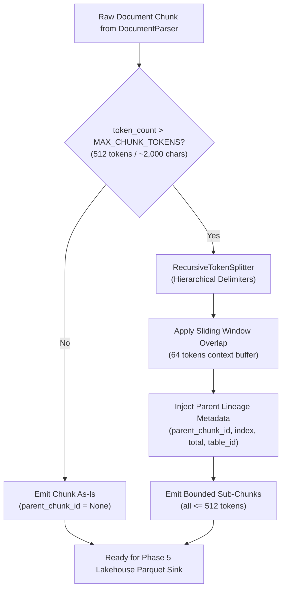

# Implementation Plan — Secondary Recursive Token Splitter & Parent Lineage Tracking (ING-04)

Build and integrate the secondary adaptive token splitting engine for the **corpus-analyst** platform (**`ING-04`**), enforcing strict upper-bound chunk limits (`MAX_CHUNK_TOKENS = 512` / `~2,000` characters), applying a 64-token sliding window overlap across split boundaries to preserve narrative and semantic context, and maintaining complete parent-child lineage tracking (`parent_chunk_id`, `sub_chunk_index`, `total_sub_chunks`, `table_id`) mapped directly to the Lakehouse Parquet storage contracts.

---

## 1. Architectural Overview & Design Decisions

### 1.1 Secondary Adaptive Splitting Architecture & Token Bounding
- In Phase 4 `ING-03`, primary document partitioning via `unstructured` extracts structural elements (narrative paragraphs, titles, section headings, and HTML tables).
- However, document elements in real-world corpora (especially SEC EDGAR 10-K/10-Q filings, dense legal footnotes, and exhaustive balance sheets) frequently exceed transformer context lengths (512 tokens).
- Downstream dense embedding models (Phase 5 `EMB-01`: `BAAI/bge-small-en-v1.5`, `ProsusAI/finbert`, `sentence-transformers/all-mpnet-base-v2`) have strict token context windows (typically 512 tokens). Passing oversized chunks causes hard truncation, dropping critical risk factors or financial data.
- **`ING-04`** introduces `RecursiveTokenSplitter` in [`src/ingestion/splitter.py`](file:///home/cc/ws/corpus-analyst/src/ingestion/splitter.py) as an adaptive secondary pipeline stage:
  - Evaluates every `Chunk` emitted by `DocumentParser`.
  - If `chunk.token_count <= max_chunk_tokens` (default 512): Passes through unmodified with `parent_chunk_id = None`.
  - If `chunk.token_count > max_chunk_tokens`: Recursively partitions the chunk into bounded sub-chunks, each strictly adhering to `token_count <= max_chunk_tokens`.



### 1.2 Delimiter Hierarchy & Recursive Splitting Algorithm
- The splitter executes an ordered delimiter hierarchy to preserve semantic continuity:
  1. `"\n\n"` — Paragraph / structural block breaks (preserves high-level semantic units).
  2. `"\n"` — Line breaks / table row breaks (preserves list items and tabular rows).
  3. `". "` — Sentence boundaries (preserves grammatical clauses).
  4. `" "` — Word boundaries (preserves complete terminology and numerical values).
  5. `""` — Character-level fallback for unbroken tokens (e.g. extremely long strings without whitespace) to guarantee that no chunk ever exceeds `MAX_CHUNK_TOKENS`.
- For each recursion level:
  - The text is split by the current delimiter.
  - Slices are greedily accumulated until adding the next slice would exceed `max_chunk_tokens` (accounting for sliding window overlap).
  - If an individual slice exceeds `max_chunk_tokens`, that slice is passed down to the next finer delimiter in the hierarchy.

### 1.3 Sliding Window Context Overlap (64 Tokens)
- Context fragmentation at chunk boundaries can sever vital financial or narrative relationships (e.g., condition preceding a consequence, or subject preceding a metric).
- To maintain contextual continuity:
  - When a split chunk $C_k$ is finalized, trailing tokens up to `chunk_overlap_tokens` (default: 64 tokens, configurable via `ChunkingSettings`) are extracted.
  - This overlap text is prepended as a context prefix to the subsequent chunk $C_{k+1}$.
  - The combined chunk $C_{k+1}$ (overlap prefix + new content) is strictly bounded to `token_count <= max_chunk_tokens`.
  - Overlap is bounded along clean word or sentence boundaries so that prefixes do not start with truncated word fragments.
  - Sub-chunk metadata records `metadata["overlap_tokens"] = len(overlap_tokens)` (0 for the initial chunk $C_0$).

### 1.4 Parent Lineage Tracking & Secondary Lakehouse Metadata
- When an oversized parent chunk $P$ is split into $N$ sub-chunks $[C_0, C_1, \dots, C_{N-1}]$ ($N \ge 2$):
  - Each child chunk $C_i$ receives a unique `chunk_id = uuid4()`.
  - `parent_chunk_id` is set to $P.\text{chunk\_id}$ (establishing foreign key lineage back to the primary structural element).
  - Parent document context is inherited verbatim: `doc_id`, `domain`, `source_filename`, `form_type`, `filing_date`, `section`, `page_number`, `is_table`.
  - Secondary metadata in `Chunk.metadata`:
    - `parent_chunk_id`: `str(P.chunk_id)`
    - `sub_chunk_index`: `i` (0 to $N-1$)
    - `total_sub_chunks`: `N`
    - `is_split`: `True`
    - `overlap_tokens`: number of overlap tokens prepended from $C_{i-1}$
    - `table_id`: preserved if parent chunk was tabular
  - Conforms directly to PRD Section 4.3 Parquet schema: `Chunk.to_parquet_dict()` serializes `parent_chunk_id`, `sub_chunk_index`, and `token_count` inside `metadata_json`.

### 1.5 Tabular Chunk Splitting & Layout Preservation (`is_table = True`)
- Financial statements (Balance Sheets, Statements of Cash Flows, Segment Reporting) can span dozens of rows and easily exceed 512 tokens.
- When an HTML table chunk (`is_table = True`) is split:
  - Splitting prioritizes table row delimiters (`</tr>`, `</tr>\n`, `\n`).
  - Each emitted sub-chunk retains:
    - `is_table = True`
    - `metadata["table_id"] = str(P.chunk_id)`
    - `metadata["is_table_fragment"] = True`
    - `metadata["sub_chunk_index"] = i`
    - If the fragment contains HTML table rows without outer `<table>` tags, wraps or marks the fragment so downstream parsers and retrieval models recognize it as a tabular matrix.

### 1.6 Protocol Abstraction & Pipeline Integration
- Defines `ChunkSplitterProtocol` in [`src/ingestion/splitter.py`](file:///home/cc/ws/corpus-analyst/src/ingestion/splitter.py) following TREM-Python Extensible design:
  ```python
  class ChunkSplitterProtocol(Protocol):
      def split_chunk(self, chunk: Chunk) -> list[Chunk]: ...
      def split_chunks(self, chunks: list[Chunk]) -> list[Chunk]: ...
  ```
- Injects `RecursiveTokenSplitter` into [`DocumentParser`](file:///home/cc/ws/corpus-analyst/src/ingestion/parser.py):
  - `DocumentParser(settings=..., splitter=RecursiveTokenSplitter())`
  - In `DocumentParser.parse()`: After unstructured partitioning builds initial structural chunks, it runs `self.splitter.split_chunks(raw_chunks)`.
  - Guarantees that any caller of `DocumentParser.parse()` or `DocumentParser.process()` receives only size-compliant chunks ready for Phase 5 embedding and Lakehouse storage.
  - Automatically updates `IngestionResult.chunk_count` and `IngestionResult.token_total` in [`src/ingestion/lifecycle.py`](file:///home/cc/ws/corpus-analyst/src/ingestion/lifecycle.py).

---

## 2. Pre-Agreed Testing Seams (TDD)

In compliance with the project's [TDD skill](file:///home/cc/ws/corpus-analyst/.agents/skills/tdd/SKILL.md), testing is anchored at pre-agreed public boundaries:

| Seam ID | Seam Target | Verification Scope |
| :--- | :--- | :--- |
| **`SEAM-SPLITTER`** | [`src/ingestion/splitter.py`](file:///home/cc/ws/corpus-analyst/src/ingestion/splitter.py) | Validates `RecursiveTokenSplitter.split_text()`, `.split_chunk()`, and `.split_chunks()`. Verifies: (1) strict chunk token upper bounding ($\le 512$ tokens), (2) sliding window overlap of 64 tokens across boundaries, (3) delimiter recursion fallback order (`\n\n` $\to$ `\n` $\to$ `. ` $\to$ ` ` $\to$ `""`), (4) parent lineage propagation (`parent_chunk_id`, `sub_chunk_index`, `total_sub_chunks`), (5) non-split passthrough when $\le 512$ tokens, (6) tabular chunk preservation (`is_table=True`), and (7) zero-token/empty input resilience. |
| **`SEAM-CHUNKER`** | [`tests/test_chunker.py`](file:///home/cc/ws/corpus-analyst/tests/test_chunker.py) | Validates end-to-end integration between `DocumentParser` and `RecursiveTokenSplitter`: parsing documents with oversized sections emits zero chunks exceeding 512 tokens; all chunks serialize to valid PRD Section 4.3 Parquet dictionaries with `metadata_json` embedding lineage; overlap context is verified across consecutive chunks. |
| **`SEAM-LIFECYCLE-INTEGRATION`** | [`src/ingestion/lifecycle.py`](file:///home/cc/ws/corpus-analyst/src/ingestion/lifecycle.py) | Validates that `DocumentParser.process()` with splitting enabled produces accurate `chunk_count` and `token_total` metrics in `IngestionResult`, and `LifecycleManager` successfully moves processed documents to `/data/processed/` with complete telemetry. |

---

## 3. Detailed File Deliverables

### Ingestion Splitting Engine
1. **[`src/ingestion/splitter.py`](file:///home/cc/ws/corpus-analyst/src/ingestion/splitter.py)** [NEW]:
   - `ChunkSplitterProtocol(Protocol)`: Structural interface for chunk splitters.
   - `RecursiveTokenSplitter`: Production implementation:
     - Constructor accepting `ChunkingSettings`, optional `token_counter` callable (defaulting to `estimate_token_count`), and optional custom delimiters.
     - `split_text(text: str, max_tokens: int, overlap_tokens: int) -> list[str]`: Core recursive splitting function.
     - `split_chunk(chunk: Chunk) -> list[Chunk]`: Bounding and lineage injection for a single chunk.
     - `split_chunks(chunks: list[Chunk]) -> list[Chunk]`: Batch splitter over chunk lists.
2. **[`src/ingestion/parser.py`](file:///home/cc/ws/corpus-analyst/src/ingestion/parser.py)** [MODIFY]:
   - Import `RecursiveTokenSplitter` and `ChunkSplitterProtocol`.
   - Update `DocumentParser.__init__` to accept `splitter: ChunkSplitterProtocol | None = None` (defaulting to `RecursiveTokenSplitter(settings=self.settings.chunking)`).
   - In `DocumentParser.parse()`: Pass partitioned chunks through `self.splitter.split_chunks()` before returning.
   - Preserves all existing `ING-03` capabilities while enforcing the strict 512 token upper bound.

### Test Suites
3. **[`tests/test_splitter.py`](file:///home/cc/ws/corpus-analyst/tests/test_splitter.py)** [NEW]:
   - Unit tests covering `SEAM-SPLITTER`:
     - Bounding oversized text strictly to $\le \text{max\_chunk\_tokens}$ (512 tokens).
     - Sliding window overlap verification (64 tokens shared context between adjacent chunks).
     - Delimiter precedence verification (`\n\n` paragraph split, `\n` line split, `. ` sentence split, space split, unbroken character fallback).
     - Parent lineage verification: `parent_chunk_id`, `sub_chunk_index`, `total_sub_chunks`.
     - Passthrough verification: chunks with $\le 512$ tokens are untouched with `parent_chunk_id is None`.
     - Tabular chunk splitting: large HTML tables split with `is_table = True` and `table_id` preserved.
     - Robustness on empty strings, whitespace, and extreme unbroken strings (e.g. 5,000 characters without whitespace).
4. **[`tests/test_chunker.py`](file:///home/cc/ws/corpus-analyst/tests/test_chunker.py)** [MODIFY]:
   - Contract verification tests covering `SEAM-CHUNKER`:
     - Test that documents containing massive sections (e.g. >2,000 tokens) parsed by `DocumentParser` emit only chunks $\le 512$ tokens.
     - Parquet schema verification (`to_parquet_dict()`) for split sub-chunks with lineage attributes in `metadata_json`.
     - Verification of table layout retention across split table chunks.

---

## 4. Execution & Verification Workflow

1. **Red Phase (TDD Test First)**:
   - Create [`tests/test_splitter.py`](file:///home/cc/ws/corpus-analyst/tests/test_splitter.py) with failing assertions targeting `SEAM-SPLITTER`.
   - Update [`tests/test_chunker.py`](file:///home/cc/ws/corpus-analyst/tests/test_chunker.py) with assertions verifying that `DocumentParser` bounds all chunks to $\le 512$ tokens.
2. **Green Phase (Implementation)**:
   - Implement `RecursiveTokenSplitter` in [`src/ingestion/splitter.py`](file:///home/cc/ws/corpus-analyst/src/ingestion/splitter.py).
   - Wire splitter into `DocumentParser` in [`src/ingestion/parser.py`](file:///home/cc/ws/corpus-analyst/src/ingestion/parser.py).
3. **Automated Verification**:
   - Run the complete pytest test suite in Docker:
     ```bash
     docker run --rm -v $(pwd):/app -w /app corpus-test:3.13 pytest -v tests/test_splitter.py tests/test_chunker.py tests/test_parser.py
     ```
   - Run the entire project test suite to ensure zero regressions:
     ```bash
     docker run --rm -v $(pwd):/app -w /app corpus-test:3.13 pytest -v
     ```
4. **Integration & Live SEC Verification**:
   - Ingest an actual SEC 10-K filing (e.g., `NVDA_10-K_20260225.htm` in `/data/processed/`):
     - Assert that 100% of emitted chunks have `token_count <= 512`.
     - Assert that split chunks have valid `parent_chunk_id` and sequential `sub_chunk_index`.
     - Assert that tabular chunks have `is_table = True`.

