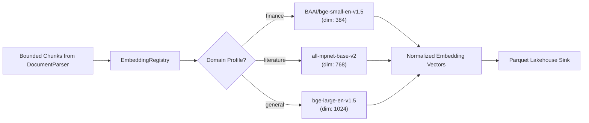
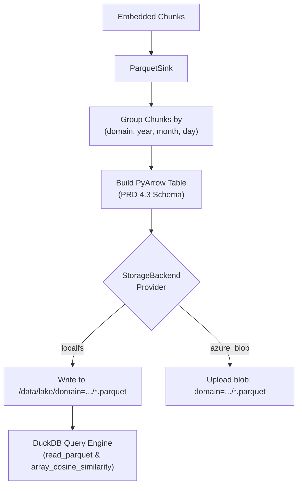

# Implementation Plan — Phase 5: Pluggable Domain Embedder & Lakehouse Parquet Storage (EMB-01, LAK-01, LAK-02s)

Implement and integrate the core dense vector embedding engine and Hive-partitioned columnar Lakehouse storage pipeline for the **corpus-analyst** platform, satisfying **`EMB-01`**, **`LAK-01`**, and **`LAK-02s`** as specified in [`feature-list.md:L124-L136`](file:///home/cc/ws/corpus-analyst/feature-list.md#L124-L136) and [`corpus-analyst-prd.md:L127-L165`](file:///home/cc/ws/corpus-analyst/corpus-analyst-prd.md#L127-L165).

---

## 1. Architectural Overview & Design Decisions

### 1.1 Dynamic Domain Embedding Registry (`EMB-01`)
- **Domain Profiles**: The platform serves diverse domains requiring distinct embedding models:
  - **`finance`**: `BAAI/bge-small-en-v1.5` (384 dimensions, batch size 32) or `ProsusAI/finbert` (768 dimensions), optimized for SEC EDGAR financial disclosures, notes, and tabular statements.
  - **`literature`**: `sentence-transformers/all-mpnet-base-v2` (768 dimensions, batch size 16) or `all-MiniLM-L6-v2` (384 dimensions), optimized for narrative prose and thematic analysis.
  - **`general`**: `BAAI/bge-large-en-v1.5` (1024 dimensions, batch size 16), general-purpose dense retriever.
- **Model Registry Architecture**:
  - `EmbeddingRegistry`: Factory and cache managing domain-specific embedder instances using specifications loaded from [`config/models.json`](file:///home/cc/ws/corpus-analyst/config/models.json).
  - Lazy Loading: Avoid eager initialization of heavy PyTorch model weights on startup; instantiate each domain's model only when requested.
  - Local Weight Caching: Store model weights in `settings.paths.model_cache_dir` (default `/root/.cache/huggingface` or persistent Docker volume `model_cache`) to prevent network downloads on every boot.
  - L2 Normalization: Automatically normalize output embeddings to unit length when `normalize_embeddings=True`, ensuring exact cosine similarity via DuckDB dot-product.
  - Deterministic Offline/Test Mode: `MockEmbedder` generating deterministic, normalized embeddings of expected dimensions (384/768/1024) based on text hashing, enabling fast, isolated unit tests in airgapped/CI environments without network access.



### 1.2 Hive-Partitioned Parquet Sink (`LAK-01`)
- **Partition Hierarchy**:
  `/data/lake/domain={domain}/year={YYYY}/month={MM}/day={DD}/{chunk_batch_uuid}.parquet`
  - `domain`: `finance`, `literature`, or `general` (from chunk metadata).
  - `year`, `month`, `day`: Derived from `chunk.filing_date`. When `filing_date` is absent, falls back to document publication date or current UTC date.
  - `chunk_batch_uuid`: UUIDv4 string per ingested batch.
- **Strict Columnar Schema (PRD Section 4.3)**:
  - `chunk_id`: `pa.string()` (UUIDv4)
  - `doc_id`: `pa.string()` (File hash or SEC accession number)
  - `domain`: `pa.string()` (`finance`, `literature`, `general`)
  - `source_filename`: `pa.string()`
  - `form_type`: `pa.string()` (`10-K`, `10-Q`, `8-K`, `BOOK`, `MISC`)
  - `filing_date`: `pa.date32()`
  - `section`: `pa.string()` (e.g., `Item 1A - Risk Factors`)
  - `is_table`: `pa.bool_()`
  - `text`: `pa.string()` (Chunk text content)
  - `embedding`: `pa.list_(pa.float32())` (Dense vector array)
  - `metadata_json`: `pa.string()` (Serialized JSON with page numbers, token count, parent lineage)
- **Batch Grouping & Atomic Writing**:
  - A batch containing chunks with different domains or dates is automatically partitioned into separate Hive directory streams.
  - Column compression uses `SNAPPY` for high read performance in DuckDB.

### 1.3 Pluggable Lakehouse Storage Pipeline (`LAK-02s`)
- **Storage Abstraction**: `ParquetSink` operates directly over [`StorageBackendProtocol`](file:///home/cc/ws/corpus-analyst/src/common/storage.py#L23-L45).
- **Multi-Cloud Readiness**:
  - `LocalStorageBackend`: Writes directly to local filesystem at `/data/lake/...`.
  - `AzureBlobStorageBackend`: Serializes Parquet bytes in-memory and uploads to the cloud container under the exact same Hive partition key prefix.
- **DuckDB Compatibility**:
  - Ingested Parquet datasets are immediately queryable via DuckDB:
    `SELECT * FROM read_parquet('/data/lake/domain=finance/**/*.parquet')`
  - DuckDB automatically extracts Hive partition directories (`domain`, `year`, `month`, `day`) as virtual columns for partition pushdown pruning.



### 1.4 Ingestion Pipeline Integration
- Update [`DocumentParser.process()`](file:///home/cc/ws/corpus-analyst/src/ingestion/parser.py#L410-L450) and [`IngestionResult`](file:///home/cc/ws/corpus-analyst/src/ingestion/lifecycle.py#L42-L54):
  - In `DocumentParser`: Accept optional `embedder: EmbedderProtocol` and `sink: ParquetSinkProtocol`.
  - In `process()`: After chunking and recursive splitting, invoke embedder and sink to write the Parquet lake file, attaching written Parquet paths to `IngestionResult.parquet_paths`.
  - In `docker/ingestion/Dockerfile`: Add `pyarrow` to container dependencies.

---

## 2. Pre-Agreed Testing Seams (TDD)

In compliance with the project's [TDD skill](file:///home/cc/ws/corpus-analyst/.agents/skills/tdd/SKILL.md), testing is anchored at pre-agreed public boundaries:

| Seam ID | Seam Target | Verification Scope |
| :--- | :--- | :--- |
| **`SEAM-EMBEDDER`** | [`src/ingestion/embedder.py`](file:///home/cc/ws/corpus-analyst/src/ingestion/embedder.py) | Validates `EmbeddingRegistry` and `DomainEmbedder` / `SentenceTransformerEmbedder`: (1) profile lookup by domain (`finance` $\to$ 384, `literature` $\to$ 768, `general` $\to$ 1024), (2) single text inference (`embed_text`), (3) batch text inference (`embed_texts`), (4) chunk embedding (`embed_chunk`, `embed_chunks`), (5) L2 vector normalization ($\|v\|_2 = 1.0$), (6) model weight caching configuration, and (7) offline/mock mode for fast test execution. |
| **`SEAM-PARQUET-SINK`** | [`src/ingestion/parquet_sink.py`](file:///home/cc/ws/corpus-analyst/src/ingestion/parquet_sink.py) | Validates `ParquetSink`: (1) Hive partition path generation matching `/data/lake/domain={domain}/year={YYYY}/month={MM}/day={DD}/{uuid}.parquet`, (2) date fallback handling when `filing_date` is None, (3) strict 11-column PyArrow Parquet schema conformance, (4) multi-partition batch routing, (5) missing embedding error guarding, and (6) Parquet roundtrip verification (PyArrow read matches written rows and vector values). |
| **`SEAM-LAKEHOUSE-STORAGE`** | [`src/ingestion/parquet_sink.py`](file:///home/cc/ws/corpus-analyst/src/ingestion/parquet_sink.py) + [`src/common/storage.py`](file:///home/cc/ws/corpus-analyst/src/common/storage.py) | Validates pluggable lakehouse storage integration (`LAK-02s`): writes via `LocalStorageBackend` persist to disk and are queryable by DuckDB; writes via `AzureBlobStorageBackend` invoke `write_bytes` with correct container keys. |
| **`SEAM-INGESTION-LAKE-E2E`** | [`src/ingestion/parser.py`](file:///home/cc/ws/corpus-analyst/src/ingestion/parser.py) + [`src/ingestion/lifecycle.py`](file:///home/cc/ws/corpus-analyst/src/ingestion/lifecycle.py) | Validates full end-to-end flow: parsing a document file (HTML/SEC filing) produces bounded chunks, embeds them, writes Hive Parquet files, updates `IngestionResult` with `parquet_paths`, and permits DuckDB `array_cosine_similarity` vector retrieval over the output. |

---

## 3. Proposed Changes

### Ingestion & Storage Core

#### [NEW] [embedder.py](file:///home/cc/ws/corpus-analyst/src/ingestion/embedder.py)
- Define `EmbedderProtocol(Protocol)` with `embed_text`, `embed_texts`, `embed_chunk`, `embed_chunks`.
- Implement `EmbeddingRegistry`:
  - Loads domain profiles from [`config/models.json`](file:///home/cc/ws/corpus-analyst/config/models.json) or [`ModelRegistryConfig`](file:///home/cc/ws/corpus-analyst/src/common/config.py#L42-L50).
  - Maintains cached embedder instances per profile.
  - Supports profile lookup by domain or profile name.
- Implement `DomainEmbedder` (production `SentenceTransformer` backend):
  - Lazy loading of model weights.
  - Batching via `profile.batch_size`.
  - Local weight caching in `settings.paths.model_cache_dir`.
  - Vector normalization.
- Implement `MockEmbedder`:
  - Deterministic pseudo-random unit-normalized vector generation based on SHA256 of text and profile dimension.
  - Enables sub-second offline testing without PyTorch model weight downloads.

#### [NEW] [parquet_sink.py](file:///home/cc/ws/corpus-analyst/src/ingestion/parquet_sink.py)
- Define `ParquetSinkProtocol(Protocol)`: `write_chunks(chunks: list[Chunk]) -> list[str]`.
- Define PyArrow schema constant matching PRD Section 4.3 with explicit Arrow types:
  - `chunk_id`: `pa.string()`
  - `doc_id`: `pa.string()`
  - `domain`: `pa.string()`
  - `source_filename`: `pa.string()`
  - `form_type`: `pa.string()`
  - `filing_date`: `pa.date32()`
  - `section`: `pa.string()`
  - `is_table`: `pa.bool_()`
  - `text`: `pa.string()`
  - `embedding`: `pa.list_(pa.float32())`
  - `metadata_json`: `pa.string()`
- Implement `HivePartitionResolver`:
  - Extracts partition keys `domain={domain}/year={YYYY}/month={MM}/day={DD}`.
  - Handles missing `filing_date` with deterministic fallback to current UTC date.
- Implement `ParquetSink`:
  - Accepts `StorageBackendProtocol` (defaults to `get_storage_backend()`).
  - Groups chunks by Hive partition keys.
  - Builds `pa.Table` and serializes to Snappy-compressed Parquet.
  - Writes through `storage_backend.write_bytes()` or direct local storage writer.
  - Returns list of created Parquet URIs.

#### [MODIFY] [lifecycle.py](file:///home/cc/ws/corpus-analyst/src/ingestion/lifecycle.py)
- Add `parquet_paths: list[str] = Field(default_factory=list, description="Generated Parquet file URIs")` to `IngestionResult`.

#### [MODIFY] [models.py](file:///home/cc/ws/corpus-analyst/src/common/models.py)
- Add `parquet_paths: list[str] = Field(default_factory=list, description="Generated Parquet file URIs")` to `IngestionSummary`.

#### [MODIFY] [parser.py](file:///home/cc/ws/corpus-analyst/src/ingestion/parser.py)
- Update `DocumentParser.__init__`:
  - Accept optional `embedder: EmbedderProtocol | None = None`.
  - Accept optional `parquet_sink: ParquetSinkProtocol | None = None`.
- In `DocumentParser.process()`:
  - If `embedder` is present, execute `self.embedder.embed_chunks(chunks)`.
  - If `parquet_sink` is present, execute `self.parquet_sink.write_chunks(chunks)`.
  - Include generated `parquet_paths` in `IngestionResult`.

#### [MODIFY] [docker/ingestion/Dockerfile](file:///home/cc/ws/corpus-analyst/docker/ingestion/Dockerfile)
- Add `pyarrow>=16.0.0` and `sentence-transformers>=3.0.0` to pip dependencies for the ingestion runner container.

---

### Test Suites

#### [NEW] [test_embedder.py](file:///home/cc/ws/corpus-analyst/tests/test_embedder.py)
- Test `SEAM-EMBEDDER`:
  - Profile resolution for `finance` (384), `literature` (768), `general` (1024).
  - Single text and batch text inference.
  - Chunk embedding population and L2 normalization ($\approx 1.0$).
  - Empty string and whitespace handling.
  - Mock embedder deterministic output and dimension compliance.

#### [NEW] [test_parquet_sink.py](file:///home/cc/ws/corpus-analyst/tests/test_parquet_sink.py)
- Test `SEAM-PARQUET-SINK` and `SEAM-LAKEHOUSE-STORAGE`:
  - Hive partition directory formatting (`domain=.../year=.../month=.../day=.../*.parquet`).
  - Fallback date handling for documents without `filing_date`.
  - Multi-partition batch splitting.
  - PyArrow table schema conformance and roundtrip validation.
  - Pluggable storage backend integration with `LocalStorageBackend` and mock `AzureBlobStorageBackend`.
  - DuckDB query compatibility: verify DuckDB can query the output file using `read_parquet` and compute `array_cosine_similarity`.

#### [MODIFY] [test_lifecycle.py](file:///home/cc/ws/corpus-analyst/tests/test_lifecycle.py)
- Validate `parquet_paths` propagation through `LifecycleManager.handle_file()`.

---

## 4. Verification Plan

### Automated Tests
1. **Targeted TDD Test Execution**:
   Run the newly created tests covering Phase 5 seams:
   ```bash
   docker run --rm -v $(pwd):/app -w /app corpus-test:3.13 pytest -v tests/test_embedder.py tests/test_parquet_sink.py
   ```
2. **Full Regression Suite**:
   Execute the entire test suite across all subsystems to ensure zero regressions:
   ```bash
   docker run --rm -v $(pwd):/app -w /app corpus-test:3.13 pytest -v
   ```
3. **DuckDB Vector Similarity Verification**:
   Verify DuckDB can read the output Parquet files and execute vector search:
   ```bash
   docker run --rm -v $(pwd):/app -w /app corpus-analyst-query-engine:latest python -c "
   import duckdb
   con = duckdb.connect(':memory:')
   res = con.execute(\"SELECT count(*) FROM read_parquet('/data/lake/**/*.parquet')\").fetchall()
   print('Lake chunks count:', res)
   "
   ```

### Manual / Integration Verification
- Ingest a sample SEC 10-K filing (e.g., `NVDA_10-K_20260225.htm`) through `DocumentParser.process()` with embedding and Parquet sink enabled.
- Confirm Parquet file is created at `/data/lake/domain=finance/year=2026/month=02/day=25/<uuid>.parquet`.
- Inspect Parquet metadata and verify all 11 columns exist with 384-dimensional dense vectors.

---

## 5. User Review Required

> [!IMPORTANT]
> **Sentence Transformers Model Weights & Airgapped Test Execution**:
> Full transformer model weights (`BAAI/bge-small-en-v1.5` ~130MB, `all-mpnet-base-v2` ~420MB, `bge-large-en-v1.5` ~1.3GB) require internet connectivity to download on first use unless pre-cached.
> In unit and CI test runs (where network access is restricted), the test suite uses `MockEmbedder` to generate deterministic vectors of exact matching dimensions without network overhead. In live Docker Compose execution, `model_cache` volume persists downloaded weights permanently.
